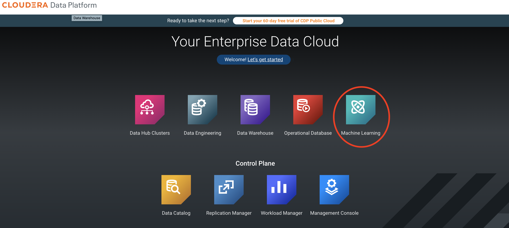

# Used Car Prediction
This project is an adaptation of the  original work of *https://github.com/abhashpanwar/used-car-price-prediction* to be used on Cloudera Machine Learning under Cloudera Data platform.

## How to use it?
1) Create a new project on Machine Learning

2) Open a session on Jupyter and explore any of the steps developed in the original work:
	
	Step 1: Data Prerpocessing on *data-preprocessing.ipynb*

	Step 2: Model Implementations on *ml-models.ipynb*
	
	Step 3: Data Visualization on *data-visualization.ipynb*

3) Run a model 
4) Call a model from the API

## URLS
Article: https://towardsdatascience.com/used-car-price-prediction-using-machine-learning-e3be02d977b2

Article code: https://github.com/abhashpanwar/used-car-price-prediction

Dataset: https://www.kaggle.com/austinreese/craigslist-carstrucks-data

